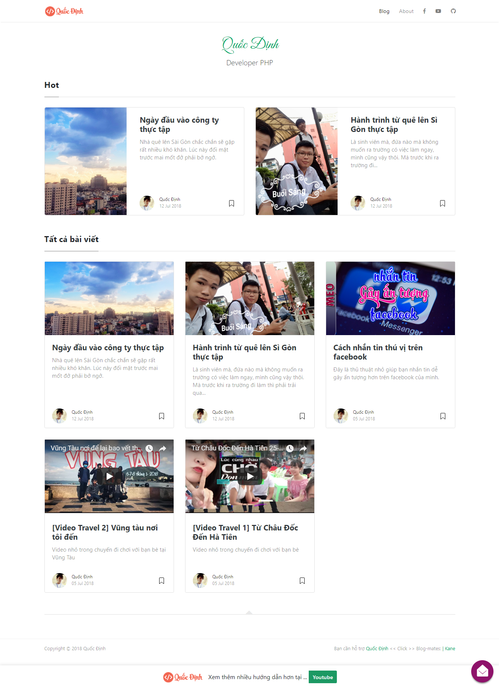

# Bạn có thể tải template này hoàn toàn miễn phí do mình tự custom lại

[Xem Demo](https://quocdinhit.tk) &nbsp; | &nbsp; [Download](https://github.com/quocdinhit97/quocdinhit97.github.io)

### Tính năng

- Xây dựng bởi Jekyll
- Tương thích với Github pages
- Viết bài
- Phân trang
- Chia sẽ bài viết
- Tích hợp:
    - Facebook Comments
    - Google Analaytics
    - Mailchimp Integration
    - tawk.to chat
- Xây dựng bởi:
    - Bootstrap v4.x
    - Font Awesome
    - Masonry
- Layouts:
    - Default
    - Post
    - Page
    - Archive
    
### Cách dùng
Sau khi Fork template về bạn tiến hành với các bước sau đây:
- Mở file <code>_config.yml</code>. Thay đổi thông một số thông tin như tiêu đề trang, thông tin kết nối với Google Analytics code, Facebook Comments, authors.
- Cài đặt 2 plugins bằng cách chạy 2 đoạn code sau: 
    - <code>$ gem install jekyll-paginate</code>
    - <code>$ gem install jekyll-archives</code>.
- Chỉnh sửa menu và footer trong file <code>default.html</code>
- Để tạo bài post bạn thêm file .md trong thư mục _post 
- Thêm một số thông tin sau ở phần trên cùng
    - featured post - <code>featured:true</code> (featured:true là post hot)
    - post image - <code>image: assets/images/mypic.jpg</code> (Khai báo phần ảnh bìa cho bài post)
    - meta description (optional) - <code>description: "this is my meta description"</code> (Mô tả của bài post)
    
Một số ví dụ: 
<pre>
---
layout: post
title:  "Đây là bài post đầu tiên"
author: quocdinhit
categories: [ quoc-dinh, tutorial ]
image: assets/images/5.jpg
featured: true
---
</pre>

Hoặc ví dụ này: 
<pre>
---
layout: page
title: Đầy là bài post thứ 2
featured:true
---
</pre>

### Copyright

Copyright (C) 2018 Quốc Định.

Cảm ơn bạn đã theo dỏi blog của tôi!

-----------------

[Facebook của tôi](https://www.facebook.com/PhungQuocDinh) &nbsp; | &nbsp; [Youtube của tôi](https://www.youtube.com/channel/UCwXIeWhUBsUDkSMzUW_sazA)
